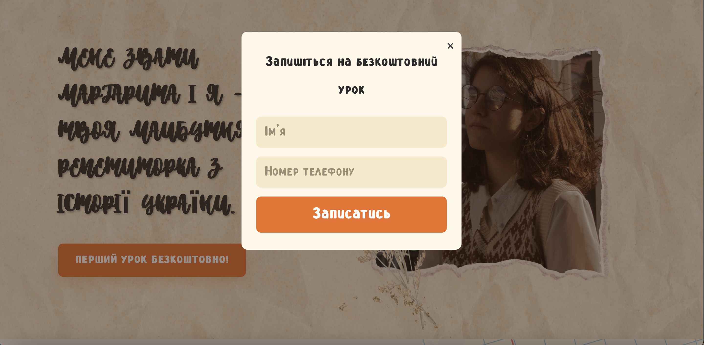
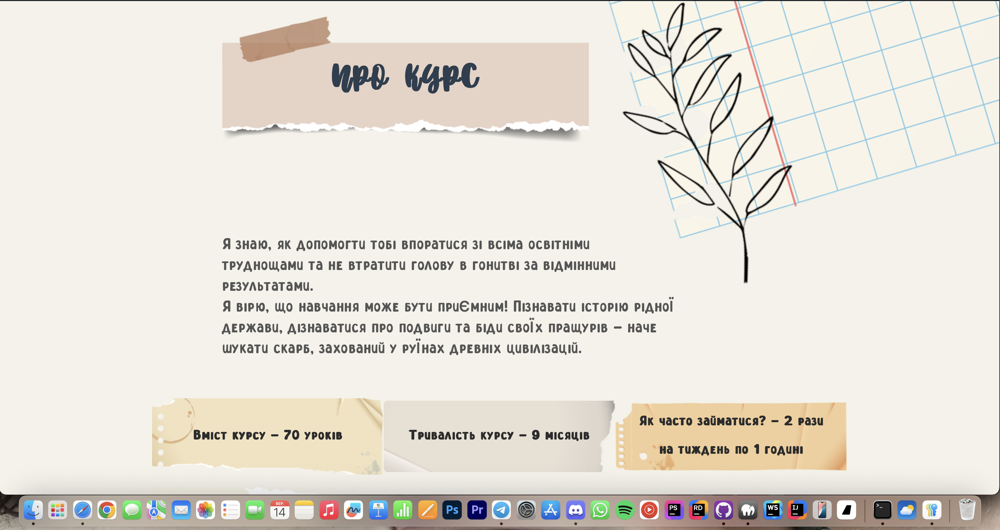
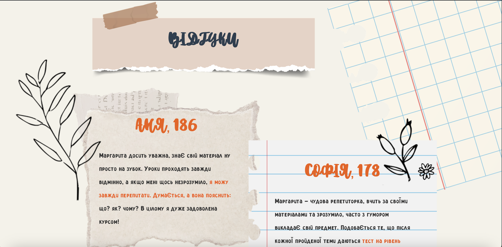
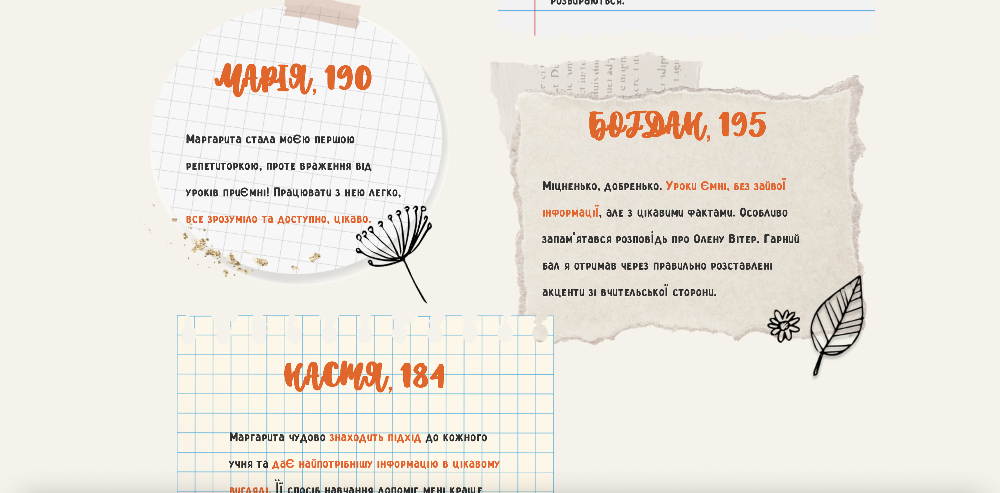
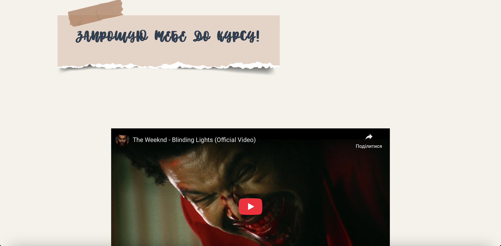
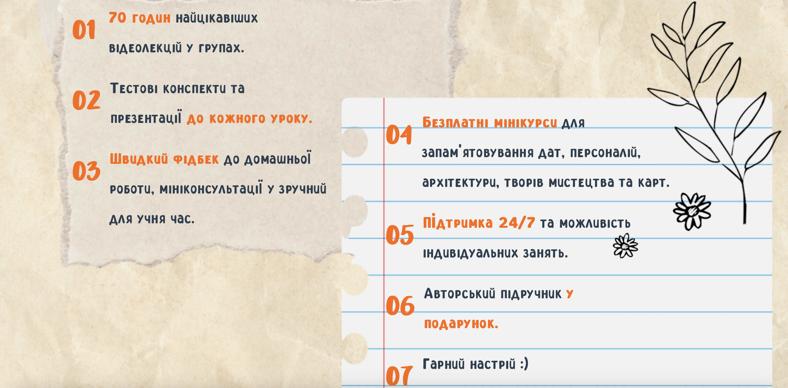
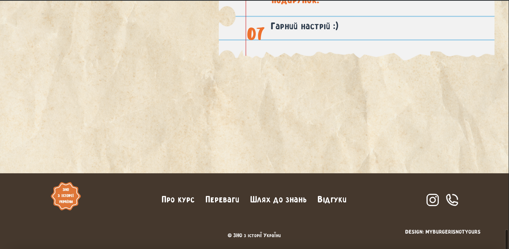

# 🎓 ZNO History — кастомна WordPress тема

**ZNO History** — це повністю кастомна тема для WordPress, розроблена з нуля.  
Сайт є навчальним лендінгом для підготовки до ЗНО з історії України.  

Проєкт створений у форматі портфоліо та може слугувати прикладом реалізації теми на замовлення.

---

## 📖 Основний функціонал
- 🖥 Кастомна тема WordPress (без використання сторонніх шаблонів).
- 🎨 Адаптивний дизайн, розроблений з нуля (HTML5, CSS3, JS).
- ⚙️ Адмінська панель із базовими налаштуваннями через JSON.
- 📑 Секції сайту:
  - Головна сторінка
  - Про курс
  - Переваги курсу
  - Шлях до знань
  - Відгуки
  - Запрошення до курсу
  - Вміст курсу
---

## 🚀 Встановлення та запуск
1. Скопіюйте папку `znohistory` у директорію `wp-content/themes/`.
2. Увійдіть у WordPress-адмінку → **Зовнішній вигляд → Теми**.
3. Активуйте тему **ZNO History**.
4. За потреби у адмінській панелі налаштуйте параметри теми (JSON).

---

## 📸 Демонстрація

|  |  |  |
|------------------------|------------------------|------------------------|
|  |  |  |
|  |  |  |
|  |
---

## 🛠 Технології
- **WordPress** як CMS
- **PHP** (шаблони та логіка теми)
- **HTML5 / CSS3**
- **JavaScript**
- **JSON** (налаштування теми)
- **MAMP** для локальної розробки

---

## 📌 Подальший розвиток (Roadmap)
- Додати блог із категоріями та пошуком.
- Інтегрувати систему запису на заняття (форми збереження у БД).
- Реалізувати підтримку мультимовності (WPML/Polylang).
- Оптимізувати швидкість (кешування, мінімізація).
- Інтеграція онлайн-оплат.

---

## ✨ Автор
Розробка та дизайн: **Dmytro Malisevych**

---
